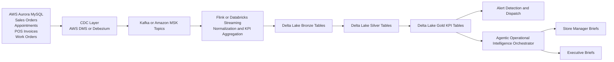

# System Overview

Target status: `agentic-operational-intelligence-platform`

This platform combines real-time operational KPI streams, alert detection, Hybrid RAG, and specialized agents to help store managers and executives monitor retail operations and improve promotion strategies.

## Operational source systems

- AWS Aurora MySQL is the system of record for the sales order system.
- AWS Aurora MySQL is the system of record for the appointment application.
- AWS Aurora MySQL is the system of record for POS invoice activities.
- AWS Aurora MySQL is the system of record for work order activities.
- Inventory signals can be joined from Aurora MySQL tables or adjacent inventory services before KPI aggregation.

The preferred production pattern is CDC from Aurora MySQL into the real-time event pipeline, followed by streaming KPI aggregation and alerting.

## Reference architecture

Reference implementation assets:

- Runtime placeholders: `config/source_connections.example.yaml`
- Application settings: `config/settings.py`
- Bronze landing tables: `data_platform/batch/databricks/bronze/README.md`
- Silver normalized tables: `data_platform/batch/databricks/silver/README.md`
- Bronze-to-silver notebook: `data_platform/batch/databricks/notebooks/bronze_to_silver_aurora_domains.ipynb`
- Sample AWS DMS to MSK task spec: `config/cdc/aws_dms_aurora_to_msk_task.example.json`
- Gold KPI tables: `data_platform/batch/databricks/gold/kpi_tables.sql`

## CDC naming conventions

- Kafka or MSK topic pattern: `retail_ops.aurora.<schema>.<table>`
- Bronze landing table pattern: `bronze.<table>_cdc`
- Silver normalized table pattern: `silver.<table>`
- Gold KPI table pattern: `gold.<business_subject>`

## Core domains

- Sales order activity
- Appointment activity
- POS invoice activity
- Inventory activity
- Work order activity
- Promotions and campaigns

## Primary user experiences

- Store Manager Copilot: localized operational diagnosis and immediate action recommendations
- Executive Copilot: regional and enterprise-level KPI rollups, promotion performance, and strategic recommendations

## Strategy adjustment workflows

- Under-performing store diagnosis: combines sales, conversion, inventory, and work-order stress signals.
- Branded upsell optimization: tracks branded revenue mix and suggests store coaching plus offer bundling.
- Promotion readiness alignment: checks inventory in-stock rate and service backlog before increasing demand.
