# Amazon EKS Architecture

Production deployment topology for the platform on Kubernetes, with AWS-managed data services replacing local containers.

## Overview

Each pipeline stage maps to one or more Kubernetes workloads or AWS managed services:

| Stage               | Local (docker-compose)               | Kubernetes / AWS                                  |
| ------------------- | ------------------------------------ | ------------------------------------------------- |
| 1 — Ingestion       | `producer` container                 | Kubernetes `Deployment` or AWS MSK Connect source |
| 2 — Flink           | Flink standalone cluster             | AWS Managed Flink (KDA) or Flink on EKS           |
| 3 — Kafka Connect   | `kafka-connect` container            | MSK Connect JDBC Sink plugins                     |
| 4 — AI Systems      | FastAPI `app` container              | EKS `Deployment` (multiple replicas) + HPA        |
| 5 — Debezium CDC    | Kafka Connect `cdc-init`             | MSK Connect Debezium plugin                       |
| 6 — Spark Streaming | `spark-cdc-streaming` container      | EMR Serverless or Databricks Structured Streaming |
| 7 — dbt Lakehouse   | Airflow `dbt-runner` + Spark Thrift  | MWAA (Managed Airflow) + Databricks SQL           |
| 8 — Analytics / ML  | `feast-server` + `qdrant` containers | AWS SageMaker Feature Store + OpenSearch          |

## Kubernetes cluster layout

```mermaid
graph TB
    subgraph EKS["Amazon EKS Cluster"]
        subgraph NS_APP["Namespace: aoip"]
            API_DEP["Deployment: aoip-api\nreplicas: 3\nHPA: 2–10 on CPU/memory"]
            MCP_DEP["Deployment: aoip-mcp\nreplicas: 2"]
            SCHED_DEP["Deployment: aoip-scheduler\nreplicas: 1"]
            API_SVC["Service: aoip-api\ntype: ClusterIP"]
            API_ING["Ingress\nnginx / ALB\nTLS termination"]
        end

        subgraph NS_DATA["Namespace: data-platform"]
            FLINK_JM["Deployment: flink-jobmanager\nreplicas: 1"]
            FLINK_TM["Deployment: flink-taskmanager\nreplicas: 3 (scalable)"]
            SPARK_OP["SparkApplication (spark-operator)\ncdc-to-landing streaming job"]
            AIRFLOW["Deployment: airflow-scheduler\nDeployment: airflow-webserver"]
            FEAST_DEP["Deployment: feast-server\nreplicas: 2"]
            QDRANT_SS["StatefulSet: qdrant\nreplicas: 1 (or 3 for HA)"]
        end

        subgraph NS_OBS["Namespace: monitoring"]
            PROM["StatefulSet: prometheus"]
            GRAF["Deployment: grafana"]
            OTEL["Deployment: otel-collector"]
        end
    end

    subgraph AWS_MANAGED["AWS Managed Services"]
        MSK["Amazon MSK\nKafka (3 brokers)"]
        MSK_SR["MSK Connect\nSchema Registry (Confluent)"]
        MSK_CONN["MSK Connect\nJDBC Sink + Debezium plugins"]
        AURORA["Aurora MySQL\nMulti-AZ cluster"]
        S3["Amazon S3\nIceberg warehouse bucket"]
        GLUE["AWS Glue Catalog\nIceberg metadata (replaces REST catalog)"]
        ELASTICACHE["ElastiCache Redis\nFeast online store + session cache"]
        DDB["DynamoDB\nPersistent session memory"]
        SM_FS["SageMaker Feature Store\n(replaces Feast)"]
        OPENSEARCH["OpenSearch\n(replaces Qdrant)"]
        RDS_AIR["RDS PostgreSQL\nAirflow metadata"]
        SECRETS["Secrets Manager\nAPI keys, DB passwords"]
        CW["CloudWatch\nLogs + Metrics"]
        SNS["SNS\nAlert dispatch → MS Teams"]
    end

    subgraph MWAA["MWAA (Managed Airflow)"]
        AIRFLOW_MWAA["Airflow Scheduler + Webserver\ndbt pipeline DAG"]
    end

    API_ING --> API_SVC --> API_DEP
    API_DEP --> ELASTICACHE
    API_DEP --> DDB
    API_DEP --> AURORA
    API_DEP --> OPENSEARCH
    API_DEP --> SM_FS
    API_DEP --> SECRETS

    FLINK_JM --> FLINK_TM
    FLINK_JM --> MSK
    FLINK_TM --> MSK

    SPARK_OP --> MSK
    SPARK_OP --> S3

    AURORA -->|"binlog"| MSK_CONN -->|"CDC topics"| MSK

    AIRFLOW_MWAA --> S3
    AIRFLOW_MWAA --> GLUE

    S3 <--> GLUE
    SM_FS --> ELASTICACHE

    API_DEP --> OTEL --> CW
    PROM --> CW
    OTEL --> PROM
    API_DEP --> SNS
```



## Kubernetes manifests structure

```
k8s/
├── namespace.yaml
├── aoip/
│   ├── deployment-api.yaml           # FastAPI replicas + HPA
│   ├── deployment-mcp.yaml
│   ├── deployment-scheduler.yaml
│   ├── service-api.yaml
│   ├── ingress.yaml                  # ALB / nginx with TLS
│   ├── configmap-app.yaml            # AOIP_* env overrides
│   └── secret-api-keys.yaml          # ANTHROPIC_API_KEY etc. (external-secrets)
├── data-platform/
│   ├── flink-jobmanager.yaml         # Deployment + Service (RPC + Web UI)
│   ├── flink-taskmanager.yaml        # Deployment (autoscaler optional)
│   ├── spark-application.yaml        # SparkApplication CRD (spark-operator)
│   ├── feast-server.yaml
│   ├── qdrant-statefulset.yaml       # or OpenSearch for production
│   └── airflow/                      # Helm values for apache/airflow chart
│       └── values.yaml
└── monitoring/
    ├── prometheus/
    └── grafana/
```

## Ingress and TLS

The FastAPI service is exposed via an Application Load Balancer Ingress (AWS) or NGINX Ingress (GCP/Azure):

```yaml
# ingress.yaml (ALB example)
apiVersion: networking.k8s.io/v1
kind: Ingress
metadata:
  name: aoip-api
  annotations:
    kubernetes.io/ingress.class: alb
    alb.ingress.kubernetes.io/scheme: internet-facing
    alb.ingress.kubernetes.io/certificate-arn: arn:aws:acm:...
spec:
  rules:
    - host: api.aoip.example.com
      http:
        paths:
          - path: /
            pathType: Prefix
            backend:
              service:
                name: aoip-api
                port:
                  number: 8000
```

## Horizontal Pod Autoscaler

The API deployment scales on CPU and custom LLM latency metrics:

```yaml
apiVersion: autoscaling/v2
kind: HorizontalPodAutoscaler
metadata:
  name: aoip-api-hpa
spec:
  scaleTargetRef:
    apiVersion: apps/v1
    kind: Deployment
    name: aoip-api
  minReplicas: 2
  maxReplicas: 10
  metrics:
    - type: Resource
      resource:
        name: cpu
        target:
          type: Utilization
          averageUtilization: 60
    - type: Pods
      pods:
        metric:
          name: llm_call_duration_ms_p95
        target:
          type: AverageValue
          averageValue: "2000"
```

## Secrets management

All secrets are injected via AWS Secrets Manager + External Secrets Operator:

```yaml
apiVersion: external-secrets.io/v1beta1
kind: ExternalSecret
metadata:
  name: aoip-secrets
spec:
  secretStoreRef:
    name: aws-secrets-manager
    kind: SecretStore
  target:
    name: aoip-secrets
  data:
    - secretKey: ANTHROPIC_API_KEY
      remoteRef:
        key: aoip/llm/anthropic_api_key
    - secretKey: AURORA_PASSWORD
      remoteRef:
        key: aoip/db/aurora_password
```

## Production replacements

| Local component         | Production equivalent                    | Notes                                                                                |
| ----------------------- | ---------------------------------------- | ------------------------------------------------------------------------------------ |
| Kafka (docker-compose)  | Amazon MSK (3-broker, multi-AZ)          | Same Kafka protocol; update `KAFKA_BROKERS`                                          |
| Schema Registry         | Confluent Schema Registry on MSK Connect | Same API                                                                             |
| Flink standalone        | AWS Managed Apache Flink (KDA)           | Same PyFlink jobs, add KDA deployment config                                         |
| MySQL ODS               | Amazon Aurora MySQL (Multi-AZ)           | Same JDBC URL pattern                                                                |
| MinIO                   | Amazon S3                                | Change `s3a://` endpoint to S3 ARN                                                   |
| Iceberg REST catalog    | AWS Glue Data Catalog                    | Set `spark.sql.catalog.iceberg.catalog-impl=org.apache.iceberg.aws.glue.GlueCatalog` |
| Spark (local)           | Amazon EMR Serverless or Databricks      | Same PySpark code                                                                    |
| Airflow (LocalExecutor) | Amazon MWAA or Astronomer                | Same DAG code                                                                        |
| Redis (docker)          | Amazon ElastiCache Redis                 | Update `AOIP_REDIS__URL`                                                             |
| SQLite session memory   | Amazon DynamoDB                          | Swap `PersistentSessionMemory` backend                                               |
| Qdrant (docker)         | Amazon OpenSearch with k-NN plugin       | Update `QDRANT_HOST`                                                                 |
| Feast (docker)          | Amazon SageMaker Feature Store           | Update Feast provider in `data_platform/feature_store/feature_store.yaml`            |
| ChromaDB (in-process)   | Amazon OpenSearch / pgvector             | Update hybrid search config                                                          |

## Architecture decision records relevant to deployment

| ADR                                                   | Decision                                                              | Status   |
| ----------------------------------------------------- | --------------------------------------------------------------------- | -------- |
| [ADR-001](adr/001-enterprise-source-integration-and-aurora-boundary.md)   | Aurora MySQL as source system — binlog CDC via DMS or Debezium        | Accepted |
| [ADR-008](adr/008-debezium-cdc-mysql-ods-to-kafka.md) | Debezium CDC from MySQL ODS to Kafka                                  | Accepted |
| [ADR-010](adr/010-medallion-lakehouse-dbt-core.md)    | Medallion lakehouse on Iceberg (landing/bronze/silver/gold/analytics) | Accepted |
| [ADR-004](adr/004-uv-python-dependency-management.md) | uv for Python dependency management — deterministic Docker builds     | Accepted |

## Terminology Glossary

Use canonical definitions from [Terminology Glossary](terminology-glossary.md) when describing platform components, data layers, and AI workflows.

## Structural Formatting Standard

This document follows the shared [Markdown Structure Standard](markdown-structure-standard.md) for heading hierarchy, section order, procedure formatting, and link conventions.
