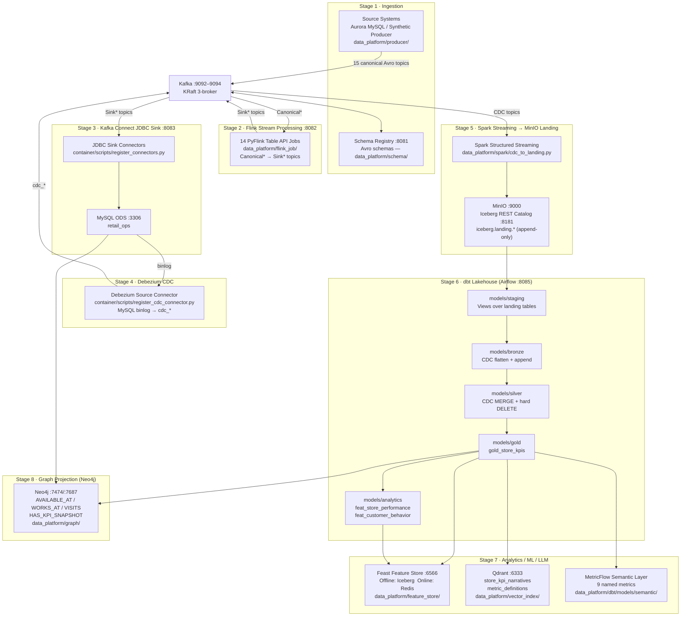

# Data Platform Architecture

Eight-stage data platform pipeline (excluding the parallel AI runtime stage) that transforms raw source-system events into a queryable Iceberg lakehouse, downstream analytics/ML layer, and Neo4j graph projections.

## Source systems and enterprise integration layer

The ingestion boundary models an enterprise integration layer that harmonizes events from operational systems into canonical topics before downstream processing. In a production deployment, this layer typically receives data from:

- ERP and order systems (for example SAP)
- CRM and appointment systems (for example Salesforce)
- Workforce and HR systems (for example Workday and Kronos)
- Vehicle inspection and service systems (for example DynamoDB-backed inspection records)
- Master data management and reference systems (stores, regions, product/article, employee, customer)

Ingestion cadence expectations:

| Cadence             | Typical sources                                       | Canonical target pattern                      |
| ------------------- | ----------------------------------------------------- | --------------------------------------------- |
| Real-time           | Appointments, orders, inspections, work orders        | Event-by-event canonical topics               |
| Near real-time      | Workforce updates, inventory adjustments, CRM updates | Micro-batched canonical topics                |
| Batch               | MDM and reference snapshots                           | Scheduled canonical snapshots and upserts     |

In this project, synthetic producers are used to mirror enterprise source-system behavior and cadence while preserving the same canonical contract and downstream processing flow.

## Pipeline stages

| #   | Stage                         | Input                         | Output                                        | Code                                                         |
| --- | ----------------------------- | ----------------------------- | --------------------------------------------- | ------------------------------------------------------------ |
| 1   | **Ingestion**                 | Aurora MySQL / synthetic data | 15 canonical Avro Kafka topics (`Canonical*`) | `data_platform/producer/` `data_platform/schema/`            |
| 2   | **Flink Stream Processing**   | `Canonical*` Kafka topics     | PDM Sink Kafka topics (`Sink*`)               | `data_platform/flink_job/` Flink :8082                       |
| 3   | **Kafka Connect JDBC Sink**   | `Sink*` Kafka topics          | MySQL ODS `retail_ops`                        | `container/scripts/register_connectors.py`                   |
| 4   | **Debezium CDC**              | MySQL ODS binlog              | `cdc_*` CDC topics                            | `container/scripts/register_cdc_connector.py`                |
| 5   | **Spark Streaming → Landing** | CDC Kafka topics              | `iceberg.landing.*` (append)                  | `data_platform/spark/cdc_to_landing.py`                      |
| 6   | **dbt Lakehouse**             | `iceberg.landing.*`           | `iceberg.bronze/silver/gold/analytics`        | `data_platform/dbt/` Airflow :8085                           |
| 7   | **Analytics / ML / LLM**      | `iceberg.gold/analytics`      | Feature store, vector index, semantic layer   | `data_platform/feature_store/` `data_platform/vector_index/` |
| 8   | **Graph Projection (Neo4j)**  | ODS + `iceberg.gold.gold_store_kpis` | Store relationship graph + KPI snapshot graph | `data_platform/graph/` Neo4j :7474/:7687 |

> The AI Systems (real-time path) runs in parallel from the MySQL ODS — see [architecture-ai-systems.md](architecture-ai-systems.md).

## Component diagram



## Stage details

### Stage 1 — Ingestion

Publishes Avro-encoded events to 15 canonical Kafka topics, mirroring enterprise source systems and integration-layer behavior across real-time, near real-time, and batch feeds.

Producer structure and controls:

- `data_platform/producer/topics/mdm/*` and `data_platform/producer/topics/transaction/*` split master vs transaction generators.
- `data_platform/producer/mdm/master_batch.py` is scheduled daily via Airflow DAG `mdm_daily_processing`.
- `data_platform/producer/transaction/realtime.py` performs startup FK checks against canonical master topics and rebinding of FK pools to existing canonical IDs.
- Customer-bearing transaction events enforce site consistency (`customerIdentifier` is selected from the same `siteNumber` store assignment).

**Canonical topics produced:**

| Domain              | Kafka topic                                                                                                                     |
| ------------------- | ------------------------------------------------------------------------------------------------------------------------------- |
| Salesforce CRM      | `CanonicalSalesforceCrmAppointment`, `CanonicalSalesforceCrmCustomer`                                                           |
| SAP Sales Orders    | `CanonicalSapSalesorderDetail`, `CanonicalSapSalesorderHybris`, `CanonicalSapSalesorderInvoice`, `CanonicalSapSalesorderVouche` |
| Trendwell Vehicles  | `CanonicalTrendwellVehivleInspection`, `CanonicalTrendwellVehivleMaster`, `CanonicalTrendwellVehivleWorkorder`                  |
| Kronos Workforce    | `CanonicalKronosCrewtime`, `CanonicalKronosEmployee`, `CanonicalKronosHours`, `CanonicalKronosSite`                             |
| Warehouse Inventory | `CanonicalWarehouseInventoryProduct`, `CanonicalWarehouseInventorySnapshot`                                                     |

Avro schemas: `data_platform/schema/*.avsc` · registered in Schema Registry at startup.

### Stage 2 — Flink Stream Processing

14 stateless PyFlink Table API jobs, one per business domain. Each job:

- Sources from a canonical Avro topic (Schema Registry deserialization)
- Applies field mapping, type casting, and domain logic
- Sinks to one or more PDM `Sink*` Kafka topics

| Pipeline            | Canonical source                      | Sink topics                                                                                                                                                        |
| ------------------- | ------------------------------------- | ------------------------------------------------------------------------------------------------------------------------------------------------------------------ |
| appointment         | `CanonicalSalesforceCrmAppointment`   | `SinkAppointment`, `SinkAppointmentSlotReservation`                                                                                                                |
| customer            | `CanonicalSalesforceCrmCustomer`      | `SinkCustomer`, `SinkCustomerContact`, `SinkCustomerAlternateIdentifier`, `SinkCustomerVehicle`                                                                    |
| sales_order         | `CanonicalSapSalesorderDetail`        | `SinkSalesOrder`, `SinkSalesOrderLineItem`, `SinkSalesOrderLineItemFee`, `SinkSalesOrderLineItemTax`, `SinkSalesOrderLineItemPromotion`, `SinkSalesOrderPromotion` |
| sales_order_receipt | `CanonicalSapSalesorderInvoice`       | `SinkSalesOrderReceipt` + 6 child tables                                                                                                                           |
| voucher             | `CanonicalSapSalesorderVouche`        | `SinkVoucher`                                                                                                                                                      |
| vehicle_inspection  | `CanonicalTrendwellVehivleInspection` | `SinkVehicleInspection`, tire detail/measurement                                                                                                                   |
| vehicle             | `CanonicalTrendwellVehivleMaster`     | `SinkVehicle`                                                                                                                                                      |
| work_order          | `CanonicalTrendwellVehivleWorkorder`  | `SinkWorkOrder` + line items, bay assignment, employee                                                                                                             |
| article             | `CanonicalWarehouseInventoryProduct`  | `SinkArticle`                                                                                                                                                      |
| inventory           | `CanonicalWarehouseInventorySnapshot` | `SinkArticleInventory`                                                                                                                                             |
| crewtime            | `CanonicalKronosCrewtime`             | `SinkReflexisWeeklyStaffMetrics`                                                                                                                                   |
| employee            | `CanonicalKronosEmployee`             | `SinkEmployee`                                                                                                                                                     |
| kronos_hours        | `CanonicalKronosHours`                | `SinkKronosHours`                                                                                                                                                  |
| site                | `CanonicalKronosSite`                 | `SinkSite`, `SinkRegion`, `SinkSiteBusinessUnit`                                                                                                                   |

Submission: `data_platform/flink_job/start_flink_job.sh <name>` or `data_platform/flink_job/start_flink_job_all.py`

### Stage 3 — Kafka Connect JDBC Sink

One JDBC Sink connector per PDM table. The `ChangeCase` SMT converts Avro camelCase field names to MySQL snake_case. `container/scripts/register_connectors.py` builds connector configs programmatically and POSTs them to the Kafka Connect REST API.

MySQL ODS database: `retail_ops` · user: `connect_user` · DDL: `data_platform/ddl/`

### Stage 4 — Debezium CDC

A single Debezium MySQL source connector reads the MySQL ODS binlog and emits Debezium-envelope messages to CDC topics:

```
cdc_sales_order
cdc_appointment
cdc_sales_order_receipt
cdc_work_order
cdc_article_inventory
```

Envelope: `{ "before": {...}, "after": {...}, "op": "c|u|d|r", "ts_ms": 123 }`

### Stage 5 — Spark Streaming → MinIO Landing (Iceberg)

`data_platform/spark/cdc_to_landing.py` subscribes to all CDC topics and appends the full Debezium envelope as rows to Iceberg landing tables. Key properties:

- Materialization: **append-only** — full CDC history preserved
- Checkpoint: `s3a://checkpoints/cdc/<table>`
- Catalog: Iceberg REST at `http://iceberg-rest:8181`
- Partition: by `days(ingested_at)`

### Stage 6 — dbt Lakehouse Transformations

dbt Core (dbt-spark, Thrift Server :10000) runs 4 transformation layers:

| Layer         | Materialization      | CDC handling                                          |
| ------------- | -------------------- | ----------------------------------------------------- |
| **staging**   | view                 | Select from `source('landing', …)`, filter tombstones |
| **bronze**    | incremental / append | Flatten `after_json`/`before_json`, tag `_cdc_op`     |
| **silver**    | incremental / merge  | MERGE by PK; `delete_cdc_rows` post-hook for deletes  |
| **gold**      | table                | Join all 5 silver entities into `gold_store_kpis`     |
| **analytics** | table                | Rolling windows, RFM, churn risk from gold            |

Airflow `dbt_lakehouse_pipeline` DAG schedules bronze→silver→gold→analytics every 30 minutes.

### Stage 7 — Analytics / ML / LLM on Lakehouse

| Component                     | Description                                                                                                                                                                                                  |
| ----------------------------- | ------------------------------------------------------------------------------------------------------------------------------------------------------------------------------------------------------------ |
| **Feast Feature Store**       | Offline store reads `iceberg.analytics.*`; materializes to Redis online store for low-latency ML feature serving (materialization runs from a prebuilt Feast runtime image with Java + pinned Spark runtime) |
| **Qdrant Vector Index**       | `store_kpi_narratives` — per-store KPI text embeddings; `metric_definitions` — business metric descriptions for AI reasoning (source order configurable via `KPI_SOURCE_TABLES`)                             |
| **MetricFlow Semantic Layer** | 9 named metrics (`revenue_total`, `appointment_show_rate`, `refund_rate`, etc.) queryable by `store_id` + `kpi_date`                                                                                         |

### Stage 8 — Graph Projection (Neo4j)

`data_platform/graph/` materializes graph relationships for operational traversal and graph-native querying.

Related ADR: [ADR-013](adr/013-neo4j-graph-projection-layer.md).

Relationships projected from ODS:

- `(:Article)-[:AVAILABLE_AT]->(:Store)` from `article_inventory`
- `(:Employee)-[:WORKS_AT]->(:Store)` from `employee` + `work_order_employee/work_order`
- `(:Customer)-[:VISITS]->(:Store)` from `sales_order`, `sales_order_receipt`, `appointment`, `work_order`

Gold projection:

- `(:Store)-[:HAS_KPI_SNAPSHOT]->(:StoreKPI)` from `iceberg.gold.gold_store_kpis`

Operational commands:

- `make graph-up`
- `make graph-sync`
- `make graph-check`

## Data conventions

| Concept               | Pattern                                      |
| --------------------- | -------------------------------------------- |
| Canonical Kafka topic | `Canonical<Domain><Entity>`                  |
| PDM Sink Kafka topic  | `Sink<Entity>`                               |
| CDC Kafka topic       | `cdc_<table>`                                |
| Iceberg landing       | `iceberg.landing.<table>`                    |
| Iceberg bronze        | `iceberg.bronze.<table>`                     |
| Iceberg silver        | `iceberg.silver.<table>`                     |
| Iceberg gold          | `iceberg.gold.gold_store_kpis`               |
| Iceberg analytics     | `iceberg.analytics.feat_<name>`              |
| Feast online key      | `store_id` or `customer_id` (Redis DB 1)     |
| Qdrant collections    | `store_kpi_narratives`, `metric_definitions` |
| Neo4j relationships   | `AVAILABLE_AT`, `WORKS_AT`, `VISITS`, `HAS_KPI_SNAPSHOT` |

## Terminology Glossary

Use canonical definitions from [Terminology Glossary](terminology-glossary.md) when describing platform components, data layers, and AI workflows.

## Structural Formatting Standard

This document follows the shared [Markdown Structure Standard](markdown-structure-standard.md) for heading hierarchy, section order, procedure formatting, and link conventions.

Documentation governance reference: [ADR-005](adr/005-documentation-governance-and-standards.md).
