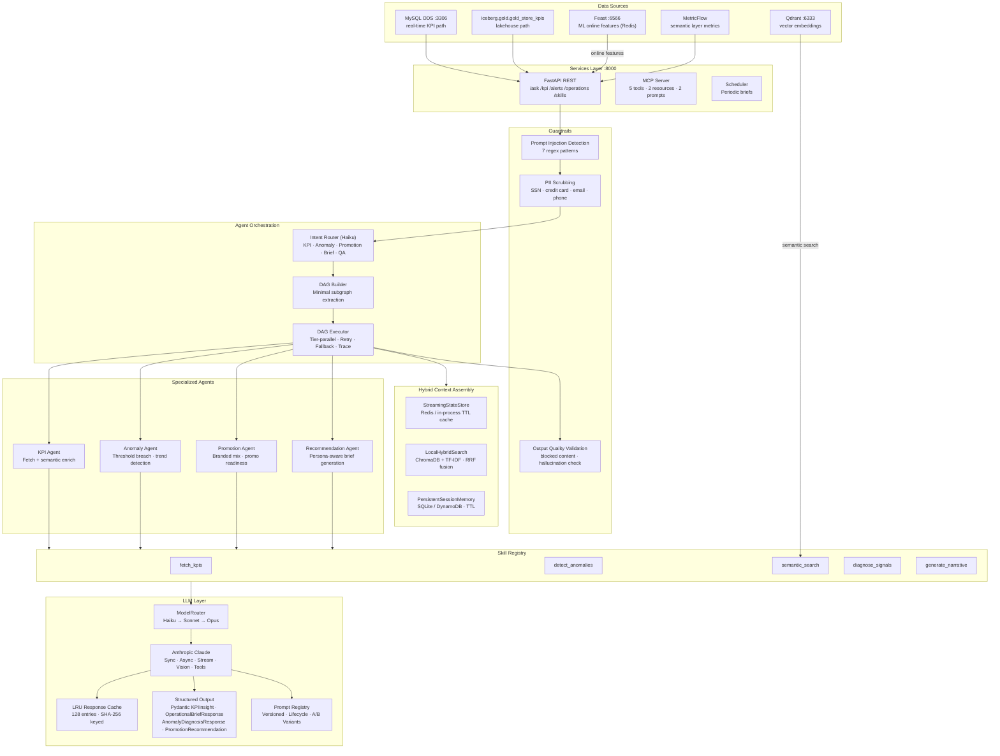
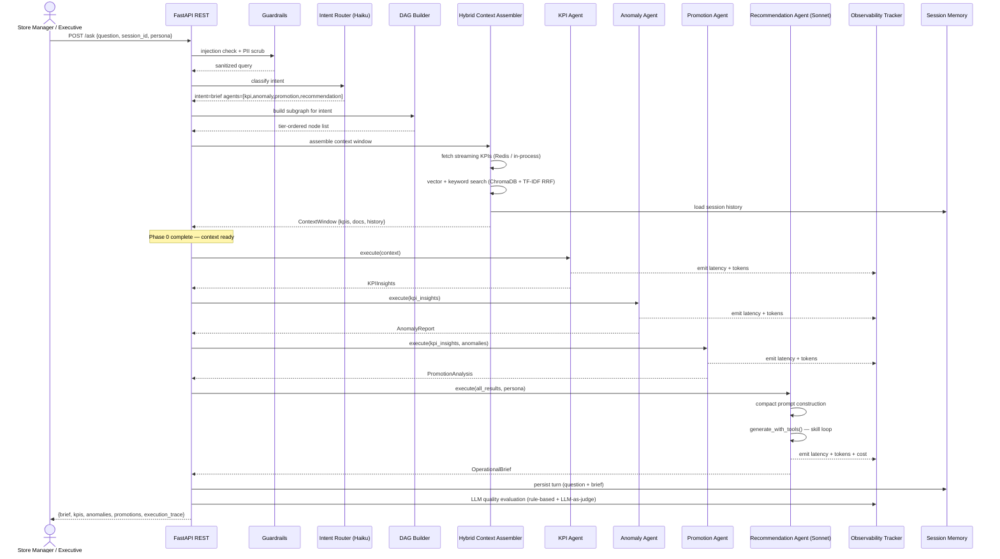
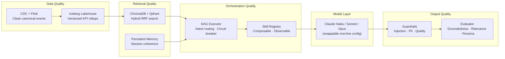

# AI Systems Architecture

The AI layer reads from two sources in parallel:
- **Real-time path** — MySQL ODS directly (Stage 4 of the data pipeline)
- **Lakehouse path** — Iceberg gold/analytics + Qdrant + Feast (Stages 7–8)

## Component overview

## Agent DAG execution flow

## Intent → agent subgraph mapping

| Intent | Triggered agents | API endpoints |
|--------|-----------------|--------------|
| `kpi_query` | kpi, rag_search | `/kpi`, `/kpi/enriched` |
| `anomaly_check` | kpi, anomaly, rag_search | `/alerts/{store_id}` |
| `promotion_analysis` | kpi, anomaly, promotion, rag_search | — |
| `operational_brief` | kpi, anomaly, promotion, recommendation, rag_search | `/operations/brief` |
| `general_qa` | all | `/ask`, `/ask/agentic` |

## Production AI stack

| Layer | Role | Implementation |
|-------|------|---------------|
| **LLM** | Natural-language generation, intent classification, diagnosis | Anthropic Claude (`claude-sonnet-4`) · `ModelRouter` (Haiku → Sonnet → Opus) · `ai_layer/llm.py` |
| **Vector Database** | Semantic search over operational knowledge corpus | ChromaDB (persistent) + TF-IDF (sparse) with reciprocal rank fusion · `ai_layer/rag/` |
| **Long-term AI search** | KPI narrative search, metric definition lookup | Qdrant `store_kpi_narratives` + `metric_definitions` · `data_platform/vector_index/` |
| **Feature serving** | Low-latency ML feature retrieval for inference | Feast online store (Redis) · `data_platform/feature_store/` |
| **Semantic metrics** | Dimension-aware business metric queries | dbt MetricFlow 9 named metrics · `data_platform/dbt/models/semantic/` |
| **Orchestration** | DAG-based agent execution with intent routing | `ai_layer/orchestration/` — dag, router, executor |
| **Skills** | Composable LLM tool-calling capabilities | `ai_layer/skills/` — SkillRegistry + 5 built-in skills |
| **Guardrails** | Input validation, output quality enforcement | `ai_layer/guardrails.py` |
| **Memory** | Multi-turn session coherence | `ai_layer/memory/persistent_memory.py` (SQLite) |
| **Prompts** | Versioned, A/B-tested prompt templates | `ai_layer/prompts.py` — PromptRegistry + ExperimentManager |
| **Structured output** | Typed, validated LLM responses | `ai_layer/structured_output.py` — Pydantic models |

## Design principle

Swapping the underlying LLM requires only one config change (`config/settings.py`). Every other layer — retrieval, orchestration, evaluation, memory, guardrails — stays unchanged.

## API endpoints

| Endpoint | Method | Description | Auth role |
|----------|--------|-------------|-----------|
| `/ask` | POST | Agentic Q&A — guardrails → intent routing → DAG execution | operator |
| `/ask/stream` | POST | SSE streaming Q&A | operator |
| `/ask/async` | POST | Non-blocking async generation | operator |
| `/ask/agentic` | POST | Tool-calling queries with skill invocation | operator |
| `/kpi` | POST | Fetch KPIs for a store or region | viewer |
| `/kpi/enriched` | POST | KPIs with semantic metadata and anomaly flags | viewer |
| `/kpi/catalog` | GET | Machine-readable KPI catalog (16 definitions) | viewer |
| `/alerts/{store_id}` | GET | Active alerts for a store | viewer |
| `/operations/brief` | POST | Persona-aware operational brief | operator |
| `/skills` | GET | List all agent skills with tool schemas | operator |
| `/skills/{name}/invoke` | POST | Invoke a skill by name | operator |
| `/usage` | GET | LLM token usage and session cost | admin |
| `/metrics` | GET | Prometheus exposition format | admin |
| `/health` | GET | Health check | public |

## Architecture decision records

| ADR | Decision | Status |
|-----|----------|--------|
| [ADR-011](adr/011-anthropic-claude-as-llm.md) | Anthropic Claude as LLM — Haiku/Sonnet/Opus routing with fallback | Accepted |
| [ADR-013](adr/013-persona-aware-orchestration.md) | Persona-aware orchestration (`store_manager` / `executive`) | Accepted |
| [ADR-015](adr/015-agent-skill-framework.md) | Skill ABC + SkillRegistry with auto-instrumented invocation | Accepted |
| [ADR-014](adr/014-dag-orchestration-intent-routing.md) | DAG-based execution with intent routing and tier-parallel agents | Accepted |
| [ADR-016](adr/016-hybrid-context-assembly.md) | Hybrid context: streaming state + vector retrieval + session memory | Accepted |
| [ADR-017](adr/017-llmops-prompt-versioning.md) | Versioned PromptRegistry + A/B ExperimentManager | Accepted |
| [ADR-018](adr/018-token-cost-efficiency.md) | LRU response cache, per-call UsageTracking, compact prompts | Accepted |
