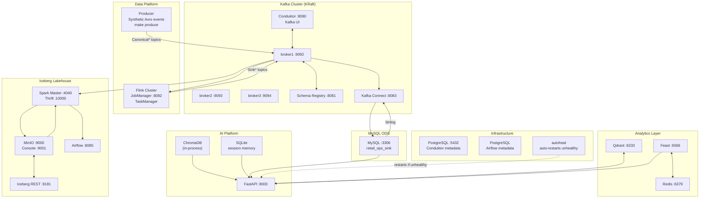

# Local Development Architecture

Full platform running as Docker Compose services on a single machine. Designed for end-to-end development and testing without cloud dependencies.

## Service map



## Container inventory

| Container | Image | Ports (host:container) | Role |
|-----------|-------|----------------------|------|
| `broker1` | confluentinc/cp-kafka:7.9.8 | 9092, 9101 (JMX) | Kafka broker 1 (KRaft) |
| `broker2` | confluentinc/cp-kafka:7.9.8 | 9093, 9102 (JMX) | Kafka broker 2 (KRaft) |
| `broker3` | confluentinc/cp-kafka:7.9.8 | 9094, 9103 (JMX) | Kafka broker 3 (KRaft) |
| `schema-registry` | confluentinc/cp-schema-registry:7.9.8 | 8081 | Avro schema catalog |
| `kafka-connect` | custom (confluentinc base + plugins) | 8083 | JDBC Sink + Debezium CDC |
| `conduktor-console` | conduktor/conduktor-console:1.25.0 | 8080 | Kafka management UI |
| `postgresql` (Conduktor) | postgres:16-alpine | — (internal) | Conduktor metadata DB |
| `mysql` | mysql:8.0 | 3306 | MySQL ODS (`retail_ops_sink`) |
| `redis` | redis:7-alpine | 6379 | Session cache + Feast online store |
| `app` | custom (container/Dockerfile) | 8000 | FastAPI platform API |
| `producer` | custom (container/Dockerfile) | — | Synthetic Avro producer (profile) |
| `flink-jobmanager` | custom (container/flink/Dockerfile) | 8082 | Flink JobManager |
| `flink-taskmanager` | custom (container/flink/Dockerfile) | — | Flink TaskManager |
| `flink-runner` | custom (container/flink/Dockerfile) | — | Job submission (one-shot) |
| `minio` | minio/minio | 9000, 9001 | S3-compatible object storage |
| `minio-init` | minio/mc | — | Creates buckets (one-shot) |
| `iceberg-rest` | tabulario/iceberg-rest:1.6.1 | 8181 | Iceberg REST catalog |
| `spark-master` | tabulario/spark-iceberg | 4040, 7077 | Spark master |
| `spark-worker` | tabulario/spark-iceberg | — | Spark worker |
| `spark-thriftserver` | tabulario/spark-iceberg | 10000 | Spark Thrift Server (dbt JDBC) |
| `spark-cdc-streaming` | tabulario/spark-iceberg | — | CDC → landing streaming job |
| `airflow-postgres` | postgres:16-alpine | — (internal) | Airflow metadata DB |
| `airflow-init` | custom (container/airflow/Dockerfile) | — | DB migrate + user create (one-shot) |
| `airflow-webserver` | custom (container/airflow/Dockerfile) | 8085 | Airflow web UI |
| `airflow-scheduler` | custom (container/airflow/Dockerfile) | — | Airflow DAG scheduler |
| `dbt-runner` | ghcr.io/dbt-labs/dbt-spark | — | dbt run on-demand |
| `qdrant` | qdrant/qdrant:v1.9.2 | 6333, 6334 | Vector database |
| `feast-server` | python:3.12-slim | 6566 | Feast online feature server |
| `vector-indexer` | python:3.12-slim | — | Qdrant index builder (one-shot) |
| `autoheal` | willfarrell/autoheal | — | Auto-restart unhealthy containers |
| `kafka-init` | confluentinc/cp-kafka:7.9.8 | — | Creates all Kafka topics (one-shot) |
| `schema-registry-init` | python:3.12-alpine | — | Registers Avro schemas (one-shot) |
| `connect-init` | python:3.12-alpine | — | Registers Kafka Connect connectors (one-shot) |
| `cdc-init` | python:3.12-alpine | — | Registers Debezium CDC connector (one-shot) |

## Startup sequence

Services start with dependency conditions (`service_healthy` / `service_completed_successfully`):

```
broker1,2,3 (healthy)
    └─▶ schema-registry (healthy)
            └─▶ kafka-connect (healthy)
                    ├─▶ kafka-init (one-shot)
                    ├─▶ schema-registry-init (one-shot)
                    ├─▶ connect-init (one-shot)
                    └─▶ cdc-init (one-shot)

minio (healthy)
    └─▶ minio-init (one-shot: creates landing/warehouse/checkpoints buckets)
            └─▶ iceberg-rest (healthy)
                    ├─▶ spark-master (healthy)
                    │       └─▶ spark-worker
                    │       └─▶ spark-thriftserver (healthy)
                    │               ├─▶ spark-cdc-streaming
                    │               └─▶ dbt-runner (on-demand)
                    └─▶ flink-jobmanager (healthy)
                            └─▶ flink-taskmanager
                            └─▶ flink-runner (on-demand)

postgresql (healthy: Conduktor)
    └─▶ conduktor-console

mysql (healthy)
    └─▶ app

redis (healthy)
    └─▶ app

airflow-postgres (healthy)
    └─▶ airflow-init (one-shot)
            └─▶ airflow-webserver + airflow-scheduler
```

## Resource limits

| Service | CPU limit | Memory limit |
|---------|-----------|-------------|
| each Kafka broker | 1.0 | 1 GiB |
| Flink JobManager | 1.0 | 2 GiB |
| Flink TaskManager | 2.0 | 3 GiB |
| Spark master | 1.0 | 1 GiB |
| Spark worker | 2.0 | 3 GiB |
| Spark Thrift Server | 1.0 | 2 GiB |
| Spark CDC streaming | 1.0 | 2 GiB |
| Conduktor Console | 1.0 | 2.5 GiB |
| Kafka Connect | 1.5 | 2 GiB |
| Airflow webserver | 0.5 | 1 GiB |
| Airflow scheduler | 1.0 | 1 GiB |
| App (FastAPI) | 2.0 | 1 GiB |
| MinIO | 0.5 | 512 MiB |
| Qdrant | 0.5 | 512 MiB |

**Recommended host RAM: 16 GiB minimum, 32 GiB comfortable** (macOS Docker Desktop: allocate at least 16 GiB).

## Service endpoints quick reference

| Service | URL | Credentials |
|---------|-----|-------------|
| Platform API | http://localhost:8000 | `X-API-Key` header |
| Conduktor | http://localhost:8080 | admin@conduktor.io / admin |
| Schema Registry | http://localhost:8081 | — |
| Flink Dashboard | http://localhost:8082 | — |
| Kafka Connect REST | http://localhost:8083 | — |
| Airflow UI | http://localhost:8085 | admin / admin |
| Spark Master UI | http://localhost:4040 | — |
| Spark Thrift JDBC | jdbc:hive2://localhost:10000 | — |
| Iceberg REST | http://localhost:8181 | — |
| MinIO Console | http://localhost:9001 | minioadmin / minioadmin |
| MinIO S3 API | http://localhost:9000 | minioadmin / minioadmin |
| Qdrant Dashboard | http://localhost:6333/dashboard | — |
| Feast Feature Server | http://localhost:6566 | — |
| Redis | localhost:6379 | — |
| MySQL ODS | localhost:3306 | connect_user / connect_pass |

## Persistent volumes

| Volume | Contents |
|--------|----------|
| `broker1_data`, `broker2_data`, `broker3_data` | Kafka KRaft log data |
| `mysql_data` | MySQL ODS (`retail_ops_sink`) |
| `postgresql_data` | Conduktor metadata |
| `airflow_postgres_data` | Airflow metadata |
| `minio_data` | Iceberg table files (all layers) |
| `qdrant_data` | Vector index data |
| `airflow_logs` | Airflow task logs |
| `redis_data` | Redis AOF persistence |

## Custom Docker images

| Image | Dockerfile | Additions over base |
|-------|-----------|-------------------|
| `app` | `container/Dockerfile` | uv, `data_platform/` source, `streaming` dep group |
| `producer` | `container/Dockerfile` | Same as app (profiles: producer) |
| `flink-*` | `container/flink/Dockerfile` | Python 3.12, PyFlink, Iceberg connector JAR (built by `make flink-jar`) |
| `airflow-*` | `container/airflow/Dockerfile` | apache/airflow:2.9.3 + dbt-spark[PyHive] + libsasl2 |
