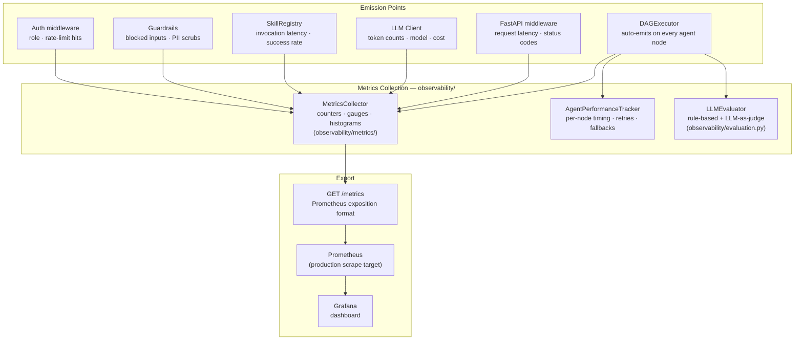

# Observability Architecture

The platform exposes three observability surfaces: a Prometheus-compatible metrics endpoint, a structured LLM evaluation framework, and per-agent performance tracking.

## Components



## Metrics catalog

### Data freshness

| Metric | Type | Description |
|--------|------|-------------|
| `kpi_event_lag_seconds` | gauge | Lag between source event commit and KPI availability |
| `source_topic_lag_records` | gauge | Kafka consumer group lag per topic |
| `gold_table_update_latency_seconds` | histogram | Time from Airflow DAG trigger to gold table refresh |

### AI quality

| Metric | Type | Source |
|--------|------|--------|
| `answer_grounding_score` | histogram | `LLMEvaluator._eval_groundedness()` |
| `eval_relevance_score` | histogram | `LLMEvaluator._eval_relevance()` |
| `eval_persona_fit_score` | histogram | `LLMEvaluator._eval_persona_fit()` |
| `eval_conciseness_score` | histogram | `LLMEvaluator._eval_conciseness()` |
| `eval_actionability_score` | histogram | `LLMEvaluator._eval_actionability()` |
| `llm_judge_score` | histogram | `LLMEvaluator.evaluate_with_llm()` (LLM-as-judge) |
| `recommendation_acceptance_rate` | gauge | User feedback signal |
| `alert_precision_rate` | gauge | Alert relevance feedback |

### Agent performance

| Metric | Type | Labels |
|--------|------|--------|
| `agent_duration_ms` | histogram | `agent_name` |
| `agent_executions_total` | counter | `agent_name` |
| `agent_successes_total` | counter | `agent_name` |
| `agent_failures_total` | counter | `agent_name`, `error_type` |
| `agent_fallbacks_total` | counter | `agent_name` |
| `agent_retries_total` | counter | `agent_name` |

### LLM usage

| Metric | Type | Description |
|--------|------|-------------|
| `llm_calls_total` | counter | Total LLM API calls |
| `llm_call_duration_ms` | histogram | End-to-end latency per call |
| `llm_input_tokens_total` | counter | Input tokens consumed |
| `llm_output_tokens_total` | counter | Output tokens generated |
| `llm_cache_hits_total` | counter | LRU cache hits (saves cost) |
| `llm_estimated_cost_usd` | gauge | Session cost estimate |
| `llm_model_selected` | counter | Model used (haiku/sonnet/opus) |

### Skill execution

| Metric | Type | Labels |
|--------|------|--------|
| `skill_invocations_total` | counter | `skill_name` |
| `skill_duration_ms` | histogram | `skill_name` |
| `skill_success_rate` | gauge | `skill_name` |

### Orchestration

| Metric | Type | Description |
|--------|------|-------------|
| `dag_total_duration_ms` | histogram | Full DAG execution wall-clock time |
| `dag_tiers_executed` | histogram | Number of tiers run per request |
| `dag_aborted_total` | counter | Requests aborted by circuit breaker |
| `intent_classification_distribution` | counter | Per-intent label |
| `context_assembly_duration_ms` | histogram | Phase 0 context assembly time |

### Guardrails

| Metric | Type | Description |
|--------|------|-------------|
| `guardrail_input_blocked_total` | counter | Prompt injection detections |
| `guardrail_pii_scrubbed_total` | counter | PII fields removed from input |
| `guardrail_output_blocked_total` | counter | Output quality rejections |

### Authentication & rate limiting

| Metric | Type | Labels |
|--------|------|--------|
| `auth_requests_total` | counter | `role` |
| `auth_rejected_total` | counter | `reason` (401/403) |
| `rate_limit_exceeded_total` | counter | `role` |

### A/B experimentation

| Metric | Type | Labels |
|--------|------|--------|
| `experiment_impressions_total` | counter | `prompt_name`, `variant` |
| `experiment_mean_score` | gauge | `variant` |
| `experiment_significance_p_value` | gauge | `prompt_name` |

### Operational outcomes

| Metric | Type | Description |
|--------|------|-------------|
| `promotion_adjustment_success_rate` | gauge | Rate of acted-on promotion recommendations |
| `work_order_backlog_reduction` | gauge | WO backlog change after recommendation |
| `sales_recovery_after_alert` | gauge | Revenue trend after alert dispatch |
| `branded_mix_uplift_after_recommendation` | gauge | Branded revenue share change |
| `underperforming_store_recovery_rate` | gauge | Stores recovering after brief dispatch |

## LLM evaluation

`LLMEvaluator` (in `observability/evaluation.py`) scores each LLM output on five criteria, using rule-based checks with an optional LLM-as-judge fallback:

| Criterion | Rule-based check | LLM-as-judge prompt |
|-----------|-----------------|---------------------|
| **Groundedness** | Key entities from context appear in response | "Is every factual claim in the response supported by the provided context?" |
| **Relevance** | Response addresses the question topic | "Does the response directly answer the user's question?" |
| **Persona fit** | Appropriate tone for store_manager vs executive | "Is the language and framing appropriate for a [persona]?" |
| **Conciseness** | Response length within expected range | "Is the response unnecessarily verbose or too brief?" |
| **Actionability** | Contains at least one specific action item | "Does the response give the user something concrete to do?" |

## Distributed tracing

OTel tracing is optional (disabled by default). Enable via:

```bash
AOIP_OTEL__ENABLED=true
AOIP_OTEL__ENDPOINT=http://otel-collector:4317
AOIP_OTEL__SERVICE_NAME=aoip
```

`observability/tracing.py` wraps agent node execution spans with parent trace propagation.

## Architecture decision records

| ADR | Decision | Status |
|-----|----------|--------|
| [ADR-010](adr/010-observability-and-evaluation.md) | `MetricsCollector` + `LLMEvaluator` + `AgentPerformanceTracker` with Prometheus export | Accepted |
| [ADR-012](adr/012-token-cost-efficiency.md) | Per-call `LLMUsage` tracking with session-level cost summaries | Accepted |
