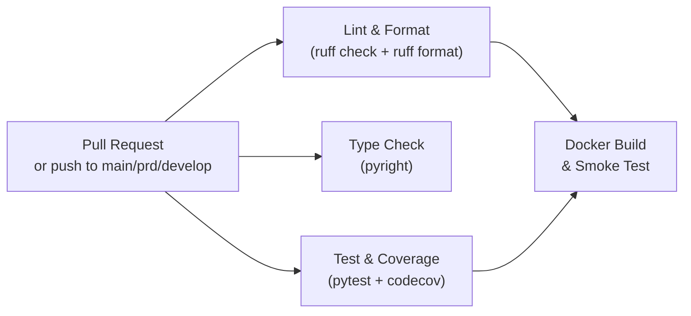

# CI/CD Automation

Continuous integration and deployment for the Agentic Operational Intelligence Platform.

## GitHub Actions pipeline

Defined in `.github/workflows/ci.yml`. Triggered on push to `main`, `prd`, and `develop`; and on pull requests targeting `main` or `prd`.

Concurrent runs for the same branch are cancelled automatically (`concurrency: cancel-in-progress: true`).



## Jobs

### Lint & Format

Runs `ruff check` (lint rules E/F/W/I/UP/B/SIM) and `ruff format --check` with GitHub-annotated output. Fails the pipeline on any violation.

```yaml
- name: Ruff lint
  run: uv run ruff check . --output-format=github
- name: Ruff format check
  run: uv run ruff format --check .
```

### Type Check

Runs `pyright` in basic mode over `ai_systems`, `services`, `alerts`, `data_platform`, and `observability`. Currently set to `continue-on-error: true` — informational until full type coverage is achieved.

### Test & Coverage

Runs the full pytest suite with coverage collection across all five packages. Requires ≥ 40% line coverage to pass.

```bash
uv run pytest tests/ \
  --cov=ai_systems --cov=services --cov=alerts \
  --cov=data_platform --cov=observability \
  --cov-report=xml --cov-report=term-missing \
  --cov-fail-under=40 -x --tb=short -q
```

Test environment variables injected by the CI job:

| Variable | CI value | Reason |
|----------|----------|--------|
| `AOIP_AUTH_DISABLED` | `true` | API tests hit endpoints without a key |
| `AOIP_KPI_SOURCE` | `sqlite` | Avoids pymysql / Aurora MySQL dependency |
| `AOIP_REDIS__URL` | `""` | Falls back to in-process store |
| `AOIP_TEAMS__WEBHOOK_URL` | `""` | Disables MS Teams dispatch |
| `AOIP_OTEL__ENABLED` | `false` | Disables OTel tracing |

Coverage report is uploaded to Codecov (`coverage.xml`). Failures in the upload step do not fail the pipeline (`fail_ci_if_error: false`).

### Docker Build & Smoke Test

Runs only after `lint` and `test` pass. Builds the platform API image (`container/Dockerfile`) with GitHub Actions cache, then starts the container and hits `/health`:

```bash
docker run -d --name aoip-smoke -p 8000:8000 \
  -e AOIP_AUTH_DISABLED=true \
  -e AOIP_KPI_SOURCE=sqlite \
  aoip:ci-<sha>
sleep 8
curl -f http://localhost:8000/health
```

Image is built with `push: false` — not published to a registry in CI. See [deployment](#deployment) below for publishing.

## Branch strategy

| Branch | CI | Description |
|--------|----|-------------|
| `main` | lint + typecheck + test + docker | Trunk — merges from feature branches via PR |
| `prd` | lint + typecheck + test + docker | Production-ready releases; requires PR from `main` |
| `develop` | lint + typecheck + test | Integration branch for feature work |
| `feature/*` | lint + typecheck + test (on PR) | Short-lived feature branches |

## Local pre-commit equivalents

Run the same checks locally before pushing:

```bash
make lint        # ruff check
make fmt         # ruff format (auto-fix)
make typecheck   # pyright
make test        # pytest
make test-cov    # pytest + coverage report
```

## Deployment

### Platform API (Docker / ECS / EKS)

The CI pipeline does not push images automatically. To publish:

```bash
# Build and tag
docker build -t <ecr-repo>/aoip:$(git rev-parse --short HEAD) \
  -f container/Dockerfile .

# Push to ECR
aws ecr get-login-password --region <region> | \
  docker login --username AWS --password-stdin <ecr-repo>
docker push <ecr-repo>/aoip:$(git rev-parse --short HEAD)

# Update ECS service or EKS Deployment
aws ecs update-service --cluster aoip --service aoip-api \
  --force-new-deployment
```

### Flink JAR + image

The Flink connector JAR must be built before the Flink Docker image:

```bash
make flink-jar          # mvn package → container/flink/target/kda-dependencies-2.2.0.jar
docker build -t <ecr-repo>/aoip-flink:<tag> \
  -f container/flink/Dockerfile .
```

For AWS Managed Flink (KDA): upload the JAR to S3 and update the KDA application version.

### dbt + Airflow

dbt models run inside the `dbt-runner` container (local) or MWAA (production). No separate build step — models are bind-mounted in local dev and S3-synced in MWAA.

```bash
# Sync DAGs to MWAA S3 bucket
aws s3 sync container/airflow/dags/ s3://<mwaa-bucket>/dags/
aws s3 sync data_platform/dbt/ s3://<mwaa-bucket>/dbt/
```

## Adding a new CI job

1. Add a new job block to `.github/workflows/ci.yml`.
2. Set `needs: [lint, test]` if the job should only run after quality gates pass.
3. Use `uv sync --frozen` for deterministic dependency installation.
4. Inject test-safe environment variables to avoid external service calls.

## Coverage gate

Current minimum: **40%** (`--cov-fail-under=40`).

To raise the gate after adding tests:

```bash
# Check current coverage
make test-cov

# Update threshold in ci.yml
--cov-fail-under=60   # or higher
```

Packages excluded from coverage (defined in `pyproject.toml`):

```toml
[tool.coverage.run]
omit = [
    "tests/*",
    "data_platform/batch/*",
]
```
