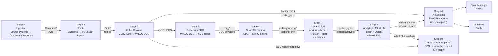
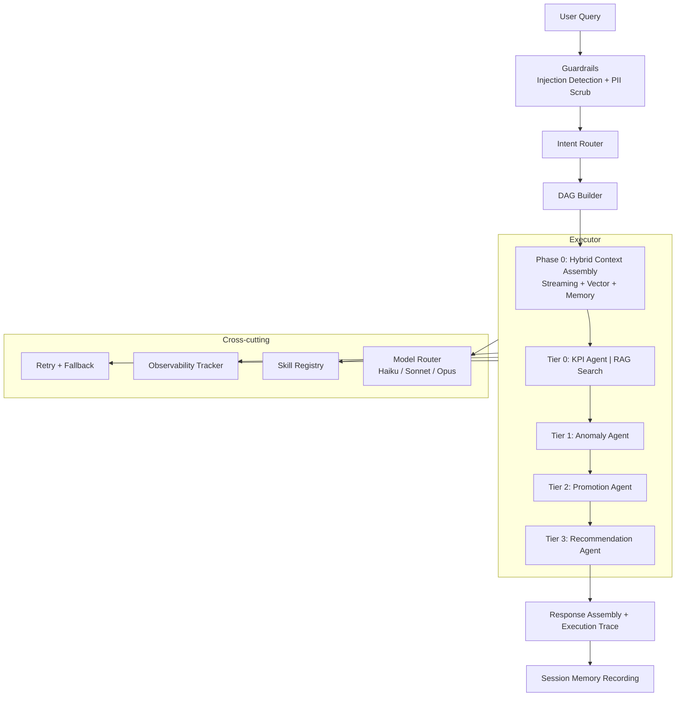
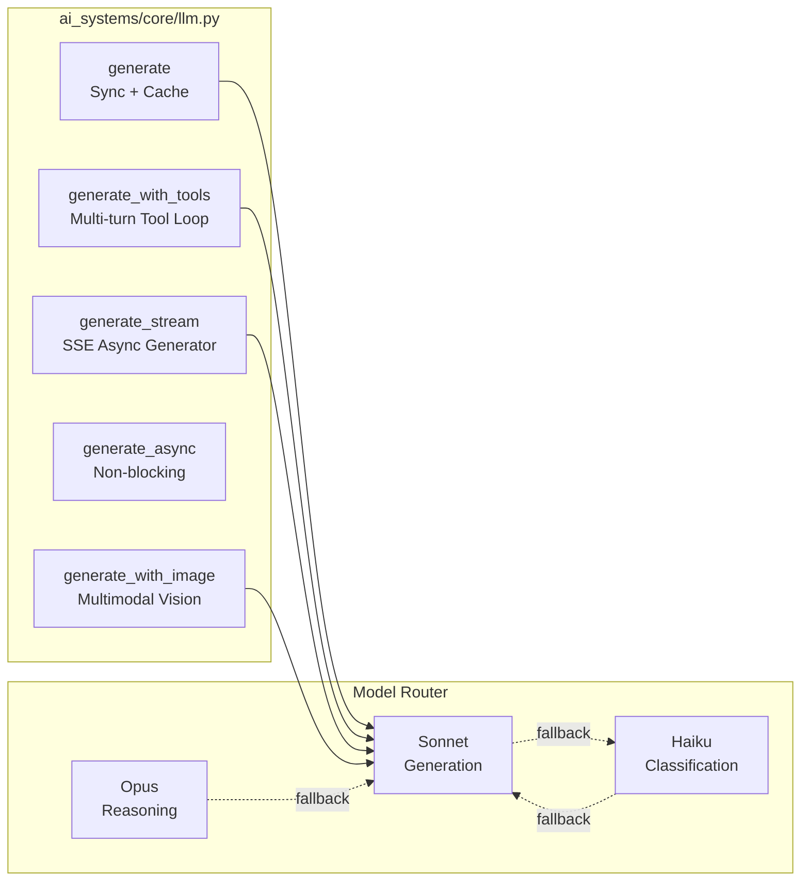

# System Overview

Platform combining real-time operational KPI streams, alert detection, Hybrid RAG, and specialized agents to help store managers and executives monitor retail operations and improve promotion strategies.

The platform starts with an enterprise integration layer that sources ERP, CRM, workforce, inspection, MDM, and reference data into canonical topics using real-time, near real-time, and batch ingestion patterns. In this repository, synthetic producers are used to mirror those upstream source systems while preserving the same canonical contracts.

See the split architecture documents for details:

- [Data Platform](architecture-data-platform.md) — pipeline stages 1–9, Kafka, Flink, dbt, lakehouse, graph projection
- [AI Systems](architecture-ai-systems.md) — agents, LLM, RAG, orchestration
- [Observability](architecture-observability.md) — metrics, evaluation, tracing
- [Local Development](architecture-local.md) — Docker Compose service map
- [Kubernetes / Production](architecture-amazon-eks.md) — EKS layout, AWS replacements
- [Frameworks and Design Patterns](frameworks-and-design-patterns.md) — stack catalog and implementation patterns
- [Runbook](runbook.md) — setup and operational procedures

## Nine pipeline stages

The platform decomposes into nine independently deployable stages:

| #   | Stage                         | Role                                                                                        | Input                         | Output                                              | Code                                                         |
| --- | ----------------------------- | ------------------------------------------------------------------------------------------- | ----------------------------- | --------------------------------------------------- | ------------------------------------------------------------ |
| 1   | **Ingestion**                 | Publishes source-system events as Avro messages to canonical Kafka topics                   | Aurora MySQL / synthetic data | 15 canonical Avro Kafka topics (`Canonical*`)       | `data_platform/producer/` `data_platform/schema/`            |
| 2   | **Flink Stream Processing**   | 14 PyFlink Table API jobs transform canonical topics into PDM Sink topics                   | `Canonical*` Kafka topics     | `Sink*` Kafka topics                                | `data_platform/flink_job/` Flink :8082                       |
| 3   | **Kafka Connect JDBC Sink**   | JDBC Sink connectors write PDM Sink topics to MySQL ODS tables                              | `Sink*` Kafka topics          | MySQL `retail_ops` :3306                            | `container/scripts/register_connectors.py`                   |
| 4   | **AI Systems (real-time)**    | FastAPI + agentic AI layer queries MySQL ODS for KPIs, anomalies, and briefs                | MySQL ODS                     | Agent responses, alerts                             | `ai_systems/gateway/api/` `ai_systems/` :8000                |
| 5   | **Debezium CDC**              | Debezium captures MySQL ODS changes into CDC Kafka topics                                   | MySQL ODS binlog              | `cdc_*` topics                                      | `container/scripts/register_cdc_connector.py`                |
| 6   | **Spark Streaming → Landing** | Spark reads CDC topics, appends Debezium envelope to Iceberg landing tables                 | CDC Kafka topics              | `iceberg.landing.*` (append)                        | `data_platform/spark/cdc_to_landing.py`                      |
| 7   | **dbt Lakehouse**             | dbt transforms landing through bronze/silver/gold/analytics. Airflow schedules every 30 min | `iceberg.landing.*`           | `iceberg.bronze/silver/gold/analytics`              | `data_platform/dbt/` Airflow :8085                           |
| 8   | **Analytics / ML / LLM**      | Feast materializes features; Qdrant indexes KPI embeddings; MetricFlow serves named metrics | `iceberg.gold/analytics`      | Feature store (Redis), vector index, semantic layer | `data_platform/feature_store/` `data_platform/vector_index/` |
| 9   | **Graph Projection (Neo4j)**  | Loads ODS relationships and gold KPI snapshots into graph structures for traversal/query      | ODS + `iceberg.gold.gold_store_kpis` | `AVAILABLE_AT`/`WORKS_AT`/`VISITS` + `HAS_KPI_SNAPSHOT` | `data_platform/graph/` Neo4j :7474/:7687                    |

Stage 8–9 implementation notes:

- Feast materialization is executed through a prebuilt container runtime (Java + pinned Spark runtime), not runtime apt/pip bootstrap.
- Vector indexing resolves KPI sources in configured order via `KPI_SOURCE_TABLES`; optional sample fallback is controlled by `KPI_FALLBACK_MODE`.
- Neo4j projection runs via `make graph-sync`; relationship counts are verified with `make graph-check`.

## Platform layers

| Layer                                  | Components                                                                     |
| -------------------------------------- | ------------------------------------------------------------------------------ |
| **Ingestion (Stages 1–2)**             | Source producer → Kafka (canonical Avro) → Flink (canonical → PDM Sink topics) |
| **ODS Write (Stage 3)**                | Kafka Connect JDBC Sink → MySQL `retail_ops`                                   |
| **Real-time AI (Stage 4)**             | FastAPI + AI agents reading MySQL ODS directly                                 |
| **CDC Capture (Stage 5)**              | Debezium → CDC Kafka topics                                                    |
| **Lakehouse Ingestion (Stage 6)**      | Spark Streaming → MinIO (Iceberg landing, append)                              |
| **Lakehouse Transformation (Stage 7)** | dbt (bronze/silver/gold/analytics) via Spark Thrift, scheduled by Airflow      |
| **Analytics / ML (Stage 8)**           | Feast feature store + Qdrant vector index + MetricFlow semantic layer          |
| **Graph Layer (Stage 9)**              | Neo4j relationship graph and gold KPI snapshot projection                        |

## Reference architecture

## Agent orchestration

## LLM interaction modes

## Implementation reference

| Component           | Source                                                          |
| ------------------- | --------------------------------------------------------------- |
| LLM client          | `ai_systems/core/llm.py`                                        |
| Model router        | `ai_systems/core/model_router.py`                               |
| Guardrails          | `ai_systems/core/guardrails.py`                                 |
| Structured output   | `ai_systems/core/structured_output.py`                          |
| Tool-calling loop   | `ai_systems/tools/calling.py`                                   |
| DAG orchestration   | `ai_systems/orchestration/dag.py`                               |
| Intent router       | `ai_systems/orchestration/router.py`                            |
| DAG executor        | `ai_systems/orchestration/executor.py`                          |
| Skill registry      | `ai_systems/skills.py` + `ai_systems/tools/registry.py`         |
| Hybrid context      | `ai_systems/retrieval/context.py`                               |
| Session memory      | `ai_systems/retrieval/memory.py`                                |
| A/B experiments     | `ai_systems/experimentation/manager.py`                         |
| Prompt registry     | `ai_systems/core/prompts.py`                                    |
| Observability       | `observability/evaluation.py`                                   |
| Auth + RBAC         | `ai_systems/gateway/api/auth.py`                                |
| MCP server          | `ai_systems/gateway/mcp/server.py`                              |
| KPI semantic layer  | `data_platform/semantic_layer.py`                               |
| KPI catalog         | `data_platform/kpi_catalog.yaml`                                |
| Spark CDC streaming | `data_platform/spark/cdc_to_landing.py`                         |
| Feature store       | `data_platform/feature_store/features.py`                       |
| Vector indexer      | `data_platform/vector_index/indexer.py`                         |
| Flink jobs          | `data_platform/flink_job/`                                      |
| dbt models          | `data_platform/dbt/models/`                                     |
| CDC task spec       | `ai_systems/config/cdc/aws_dms_aurora_to_msk_task.example.json` |

## Terminology Glossary

Use canonical definitions from [Terminology Glossary](terminology-glossary.md) when describing platform components, data layers, and AI workflows.

## Structural Formatting Standard

This document follows the shared [Markdown Structure Standard](markdown-structure-standard.md) for heading hierarchy, section order, procedure formatting, and link conventions.

Documentation governance reference: [ADR-005](adr/005-documentation-governance-and-standards.md).
