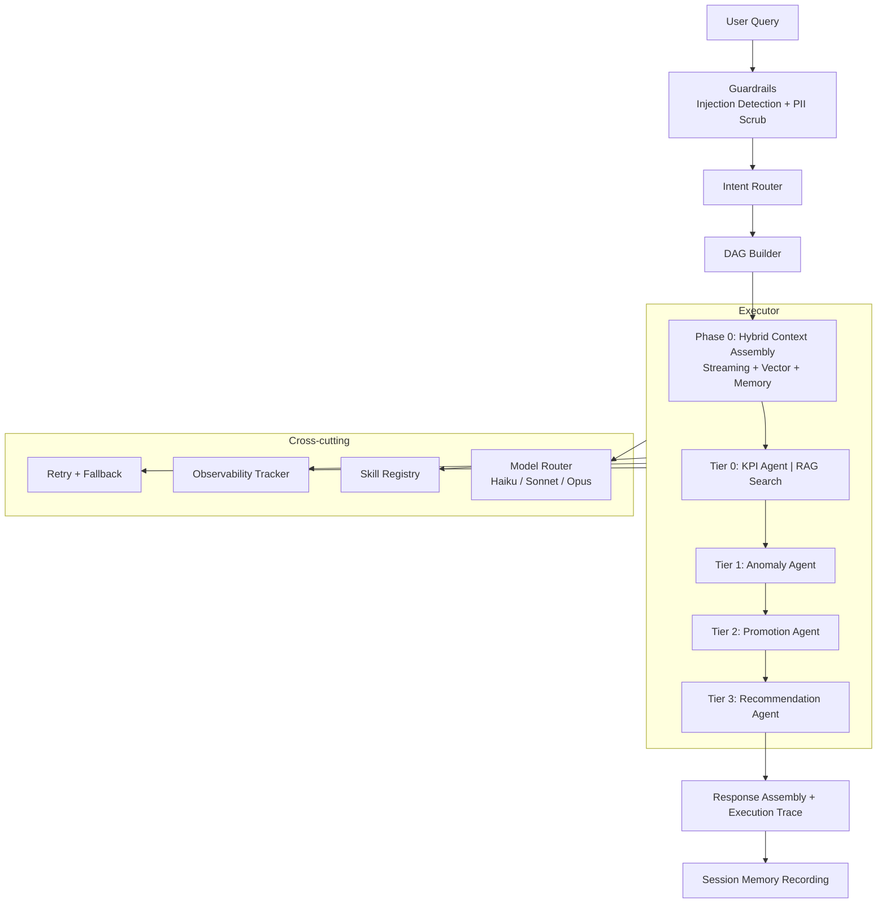
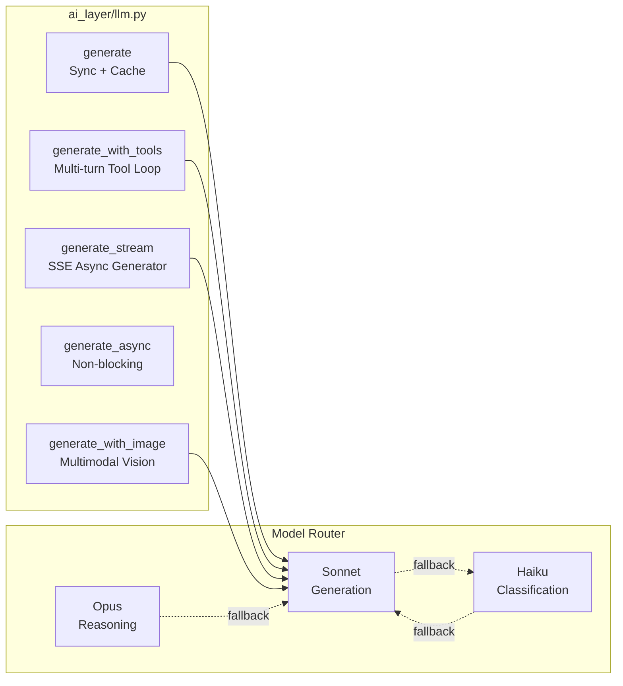

# System Overview

Platform combining real-time operational KPI streams, alert detection, Hybrid RAG, and specialized agents to help store managers and executives monitor retail operations and improve promotion strategies.

See the split architecture documents for details:
- [Data Platform](architecture_data_platform.md) — pipeline stages 1–7, Kafka, Flink, dbt, lakehouse
- [AI Systems](architecture_ai_systems.md) — agents, LLM, RAG, orchestration
- [Observability](architecture_observability.md) — metrics, evaluation, tracing
- [Local Development](architecture_local.md) — Docker Compose service map
- [Kubernetes / Production](architecture_amazon_eks.md) — EKS layout, AWS replacements
- [Runbook](runbook.md) — setup and operational procedures

## Eight pipeline stages

The platform decomposes into eight independently deployable stages:

| # | Stage | Role | Input | Output | Code |
|---|-------|------|-------|--------|------|
| 1 | **Ingestion** | Publishes source-system events as Avro messages to canonical Kafka topics | Aurora MySQL / synthetic data | 15 canonical Avro Kafka topics (`Canonical*`) | `data_platform/producer/` `data_platform/schema/` |
| 2 | **Flink Stream Processing** | 14 PyFlink Table API jobs transform canonical topics into PDM Sink topics | `Canonical*` Kafka topics | `Sink*` Kafka topics | `data_platform/flink_job/` Flink :8082 |
| 3 | **Kafka Connect JDBC Sink** | JDBC Sink connectors write PDM Sink topics to MySQL ODS tables | `Sink*` Kafka topics | MySQL `retail_ops_sink` :3306 | `container/scripts/register_connectors.py` |
| 4 | **AI Systems (real-time)** | FastAPI + agentic AI layer queries MySQL ODS for KPIs, anomalies, and briefs | MySQL ODS | Agent responses, alerts | `services/api/` `ai_layer/` :8000 |
| 5 | **Debezium CDC** | Debezium captures MySQL ODS changes into CDC Kafka topics | MySQL ODS binlog | `retail_ops.aurora.*` topics | `container/scripts/register_cdc_connector.py` |
| 6 | **Spark Streaming → Landing** | Spark reads CDC topics, appends Debezium envelope to Iceberg landing tables | CDC Kafka topics | `iceberg.landing.*` (append) | `data_platform/batch/spark/cdc_to_landing.py` |
| 7 | **dbt Lakehouse** | dbt transforms landing through bronze/silver/gold/analytics. Airflow schedules every 30 min | `iceberg.landing.*` | `iceberg.bronze/silver/gold/analytics` | `data_platform/dbt/` Airflow :8085 |
| 8 | **Analytics / ML / LLM** | Feast materializes features; Qdrant indexes KPI embeddings; MetricFlow serves named metrics | `iceberg.gold/analytics` | Feature store (Redis), vector index, semantic layer | `data_platform/feature_store/` `data_platform/vector_index/` |

## Platform layers

| Layer | Components |
|-------|-----------|
| **Ingestion (Stages 1–2)** | Source producer → Kafka (canonical Avro) → Flink (canonical → PDM Sink topics) |
| **ODS Write (Stage 3)** | Kafka Connect JDBC Sink → MySQL `retail_ops_sink` |
| **Real-time AI (Stage 4)** | FastAPI + AI agents reading MySQL ODS directly |
| **CDC Capture (Stage 5)** | Debezium → CDC Kafka topics |
| **Lakehouse Ingestion (Stage 6)** | Spark Streaming → MinIO (Iceberg landing, append) |
| **Lakehouse Transformation (Stage 7)** | dbt (bronze/silver/gold/analytics) via Spark Thrift, scheduled by Airflow |
| **Analytics / ML (Stage 8)** | Feast feature store + Qdrant vector index + MetricFlow semantic layer |

## Reference architecture

```mermaid
flowchart LR
    S1["Stage 1\nIngestion\nSource systems → Canonical Avro topics"] -->|"Canonical*\nAvro"| S2
    S2["Stage 2\nFlink\nCanonical → PDM Sink topics"] -->|"Sink*\ntopics"| S3
    S3["Stage 3\nKafka Connect\nJDBC Sink → MySQL ODS"] -->|"MySQL ODS\nretail_ops_sink"| S4
    S3 -->|"MySQL ODS"| S5
    S4["Stage 4\nAI Systems\nFastAPI + Agents\n(real-time path)"] --> OUT1["Store Manager\nBriefs"]
    S4 --> OUT2["Executive\nBriefs"]
    S5["Stage 5\nDebezium CDC\nMySQL ODS → CDC topics"] -->|"retail_ops.aurora.*\nCDC envelope"| S6
    S6["Stage 6\nSpark Streaming\nCDC → MinIO landing"] -->|"iceberg.landing.*\nappend-only"| S7
    S7["Stage 7\ndbt + Airflow\nlanding → bronze\n→ silver → gold\n→ analytics"] -->|"iceberg.gold\niceberg.analytics"| S8
    S8["Stage 8\nAnalytics / ML / LLM\nFeast + Qdrant\n+ MetricFlow"] -->|"online features\nsemantic search"| S4
```

## Agent orchestration

## LLM interaction modes

## Implementation reference

| Component | Source |
|-----------|--------|
| LLM client | `ai_layer/llm.py` |
| Model router | `ai_layer/model_router.py` |
| Guardrails | `ai_layer/guardrails.py` |
| Structured output | `ai_layer/structured_output.py` |
| Tool-calling loop | `ai_layer/tool_calling.py` |
| DAG orchestration | `ai_layer/orchestration/dag.py` |
| Intent router | `ai_layer/orchestration/router.py` |
| DAG executor | `ai_layer/orchestration/executor.py` |
| Skill registry | `ai_layer/skills/` |
| Hybrid context | `ai_layer/context.py` |
| Session memory | `ai_layer/memory/persistent_memory.py` |
| A/B experiments | `ai_layer/experimentation.py` |
| Prompt registry | `ai_layer/prompts.py` |
| Observability | `observability/evaluation.py` |
| Auth + RBAC | `services/api/auth.py` |
| MCP server | `services/mcp_server.py` |
| KPI semantic layer | `data_platform/semantic_layer.py` |
| KPI catalog | `data_platform/kpi_catalog.yaml` |
| Spark CDC streaming | `data_platform/batch/spark/cdc_to_landing.py` |
| Feature store | `data_platform/feature_store/features.py` |
| Vector indexer | `data_platform/vector_index/indexer.py` |
| Flink jobs | `data_platform/flink_job/` |
| dbt models | `data_platform/dbt/models/` |
| CDC task spec | `config/cdc/aws_dms_aurora_to_msk_task.example.json` |

